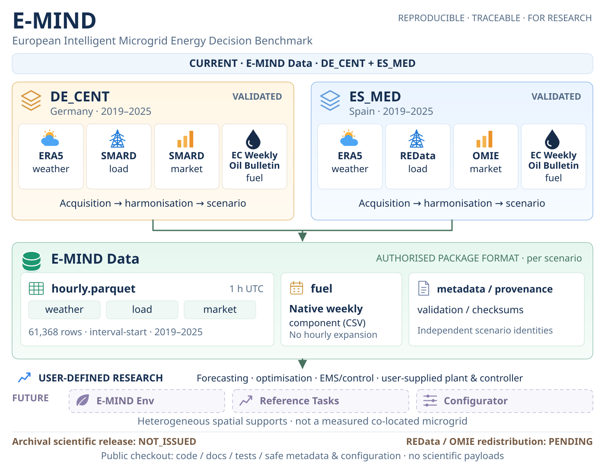

<p align="center">
  
</p>

# E-MIND — European Microgrid Intelligence for Next-generation Decision-making

A reproducible multi-region benchmark for energy management research.

Its **task-agnostic Data layer** combines traceable energy and weather signals into documented regional scenarios. Researchers choose their own forecasting, optimisation and control experiments and supply the physical assumptions those experiments need.



DE_CENT and ES_MED retain their own providers, spatial supports and provenance. Signal icons and the compact Data panel show the authorised package format; dashed boxes mark future tools. Scientific payloads are not included in the public checkout or publicly distributed yet.

## Current status

**DE_CENT and ES_MED (2019–2025) are technically validated, scientifically closed scenarios.** The public repository contains source code, tests, documentation and scenario/source metadata for this multi-region infrastructure. The software remains under development.

The scientific archival release is **NOT_ISSUED**: no public scientific payload, archived dataset or E-MIND DOI is available. REData/OMIE redistribution remains **PENDING**. E-MIND Env, Reference Tasks and Configurator are future layers; no canonical plant, reward or controller is included.

> Each scenario combines heterogeneous signals with independent spatial support. Neither represents a measured co-located physical microgrid.

## Quick start

Use **Git** and **Python 3.12**. An exact Python patch version is not pinned; previously certified baseline: 3.12.13. The following commands use a Linux / macOS shell. Clone the public repository anonymously:

```bash
git clone https://github.com/PabloPallaresFdM/E-MIND.git
cd E-MIND
```

Choose **one** environment. Conda is optional.

**Conda / Miniforge:**

```bash
conda create -n emind python=3.12 -y
conda activate emind
```

**venv:**

```bash
python3.12 -m venv .venv
source .venv/bin/activate
```

Install and verify from the checkout:

```bash
python --version
python -m pip install -r scripts/release/requirements.txt
python -m unittest discover -s tests -v
```

Success is **284 tests, `OK (skipped=15)`**: 269 passed, 15 expected skips, zero failures/errors. The skipped tests need separately supplied scientific or provenance fixtures; they are not installation errors. No provider credentials or scientific downloads are needed. E-MIND runs from this checkout; Pandas is optional. See [Getting started](docs/getting_started.md) for prerequisites, dependency checks and troubleshooting.

## Scenarios

| Scenario | Region | Period | Signals | Status |
|---|---|---|---|---|
| [DE_CENT](docs/scenarios/DE_CENT.md) | Germany | 2019–2025 | Weather / load / market / native weekly fuel | Technically validated; archival distribution pending |
| [ES_MED](docs/scenarios/ES_MED.md) | Spain | 2019–2025 | Weather / load / market / native weekly fuel | Technically validated; archival distribution pending |

## Data access

**Cloning does not download scientific data.** There is currently no public data download or integration-fixture distribution. Scientific validation and software access do not establish redistribution permission; in particular, REData/OMIE canonical and derived payload rights remain PENDING even when provider RAW is omitted.

You can inspect the [scenario registry](metadata/scenario_registry.json) and both scenario pages now. If you receive a separately authorised package, [Dataset overview](docs/dataset_overview.md#read-and-inspect-the-hourly-core) explains how to read it with PyArrow and [verify its checksums and identity](docs/dataset_overview.md#verify-checksums-and-package-identity).

Within each `scenarios/DE_CENT/` or `scenarios/ES_MED/` directory, `hourly.parquet` holds weather, load and market: **61,368 rows, 1 h UTC interval starts, 2019–2025**. Fuel remains a **native weekly CSV** under `components/fuel/`, without hourly expansion. `scenario.json`, `metadata.json`, `lineage.json`, `validation.json` and `checksums.sha256` describe and verify the scenario. See the [release schema](docs/release_schema.md#layout) for exact paths and package-level files; this format does not imply current public data availability.

## Research uses

Define forecasting, representation learning, detection, scheduling, sizing, optimisation or EMS/control experiments using authorised inputs. Supply your own plant, control algorithm, objective and information protocol. See [Research uses](docs/research_uses.md) for responsibilities and the distinction between Data, future Env / Reference Tasks and user-defined tasks.

## Documentation

- [Getting started](docs/getting_started.md) — installation and software verification.
- [Dataset overview](docs/dataset_overview.md) — data access, reading, checksums, chronological splits and demand scaling.
- [DE_CENT](docs/scenarios/DE_CENT.md) and [ES_MED](docs/scenarios/ES_MED.md) — scientific scenario profiles and limitations.
- [Research uses](docs/research_uses.md) — user-defined experiments and future layers.
- [Release schema](docs/release_schema.md) — package layout, contracts and validation.

## Citation & licensing

Cite the current source/docs checkout as Pablo Pallarés, *E-MIND — European Microgrid Intelligence for Next-generation Decision-making*, repository https://github.com/PabloPallaresFdM/E-MIND, and record its **exact commit** with `git rev-parse HEAD`. Cite upstream providers separately using their attribution metadata. There is no E-MIND DOI.

[CITATION.cff](CITATION.cff) retains `0.1.0-rc.1` for the **historical, unissued DE_CENT local candidate**; this is not the version of the current multi-region source tree. For a separately supplied authorised package, also record its version and release fingerprint.

Project code: [MIT](LICENSE). Project-authored metadata/documentation: [CC BY 4.0](LICENSE-METADATA). Upstream sources retain their [own licences and attribution requirements](metadata/licenses.json); [Spanish source terms](metadata/spanish_sources.json) remain pending. Project grants do not relicense provider data.

## Roadmap

Planned / in development: **DK_WEST, GB, FI_SOUTH, E-MIND Env, Reference Tasks and Configurator**. No delivery dates are committed. Two validated scenarios do not establish comprehensive European coverage or a complete control benchmark. An ES_MED compact profile has not been issued.
