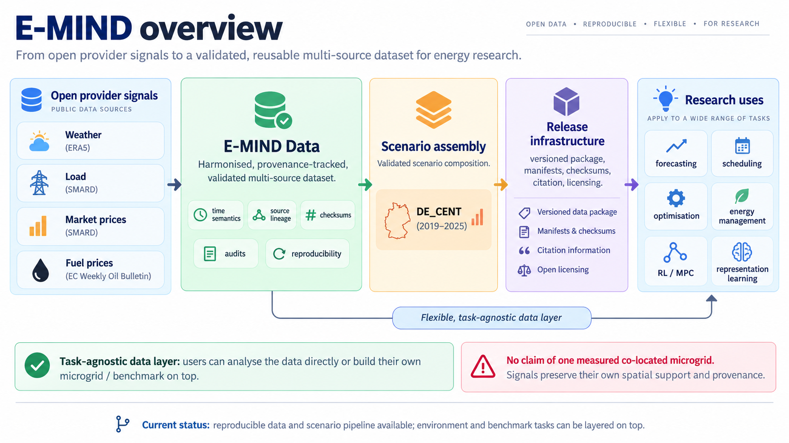

# E-MIND — European Intelligent Microgrid Energy Decision Benchmark

E-MIND is reproducible, **task-agnostic data infrastructure for intelligent energy systems research**. E-MIND Data combines traceable open energy and weather signals into documented scenarios. Researchers define their own downstream tasks and physical assumptions.



## Current status

**DE_CENT (2019–2025) is the only scientifically closed scenario.** Other European scenarios are planned / in development. E-MIND Env, Reference Tasks and the Configurator are future layers, not released tools or tasks. Software/dataset infrastructure remains **pre-release / under development**; the local candidate is NOT_ISSUED, not archived, with no E-MIND DOI.

> **DE_CENT is a historically grounded composition of heterogeneous open signals. It is not a measured co-located physical microgrid.**

## Quick start

Use **Python 3.12** (validated baseline: 3.12.14). Clone over HTTPS:

```bash
git clone https://github.com/PabloPallaresFdM/E-MIND.git
cd E-MIND
```

Choose one environment option.

**Conda / Miniforge:**

```bash
conda create -n emind python=3.12 -y
conda activate emind
```

**venv** (Linux / macOS):

```bash
python3.12 -m venv .venv
source .venv/bin/activate
```

Install and verify:

```bash
python -m pip install -r scripts/release/requirements.txt
python -m unittest discover -s tests -v
```

Public software-only baseline: **248 total, 233 passed, 15 skipped, 0 failures, 0 errors**. Eleven skips require accepted scientific integration inputs; four require optional frozen provenance fixtures. These expected skips do not indicate a failed installation. E-MIND runs from the checkout. See [Getting started](docs/getting_started.md) for prerequisites, clean-fixture testing and troubleshooting.

## Get the data

Scientific data are maintained separately from Git. **The public archival data release has not been issued**, and there is no public download or matching integration-fixture distribution yet. Installing the software does not download data. For an authorised standalone package, see [Dataset overview](docs/dataset_overview.md) and [DE_CENT](docs/scenarios/DE_CENT.md) for reading, integrity checks and interpretation. While the repository remains private, cloning requires authorised GitHub access.

## What is available

| Scenario | Region | Period | Signals | Scientific status |
|---|---|---|---|---|
| DE_CENT | Germany | 2019–2025 | Weather / load / market / fuel | Closed; public data distribution pending |

## Research uses

The data/scenario layer supports user-defined forecasting, representation learning, detection, scheduling, sizing, optimisation and EMS/control experiments. Control algorithms, a canonical plant, actions and reward are not supplied. See [Research uses](docs/research_uses.md) for responsibilities and the distinction between Data, future Env / Reference Tasks and user-defined tasks.

## Documentation

- [Getting started](docs/getting_started.md) — installation and software verification.
- [Dataset overview](docs/dataset_overview.md) — data access, reading, checksums, chronological splits and demand scaling.
- [DE_CENT](docs/scenarios/DE_CENT.md) — scientific scenario profile and limitations.
- [Research uses](docs/research_uses.md) — user-defined experiments and future layers.
- [Release schema](docs/release_schema.md) — package layout, contracts and validation.

## Citation & licensing

Use [CITATION.cff](CITATION.cff): Pablo Pallarés, *E-MIND — European Intelligent Microgrid Energy Decision Benchmark*, local candidate `0.1.0-rc.1`, repository https://github.com/PabloPallaresFdM/E-MIND. Record the exact checkout commit (`git rev-parse HEAD`), or a supplied package's version and release fingerprint. **DOI pending:** this is a pre-release citation, not an archived publication. Cite upstream providers separately using attribution metadata.

Project code: [MIT](LICENSE). Project-authored metadata/documentation: [CC BY 4.0](LICENSE-METADATA). Upstream sources retain their [own licences and attribution requirements](metadata/licenses.json); project grants do not relicense provider data.

## Roadmap

Planned / in development: **DK_WEST, GB, FI_SOUTH, ES_MED compact profile, E-MIND Env, Reference Tasks and Configurator**. No delivery dates are committed. The current single closed scenario does not establish a completed multi-region or control benchmark.
