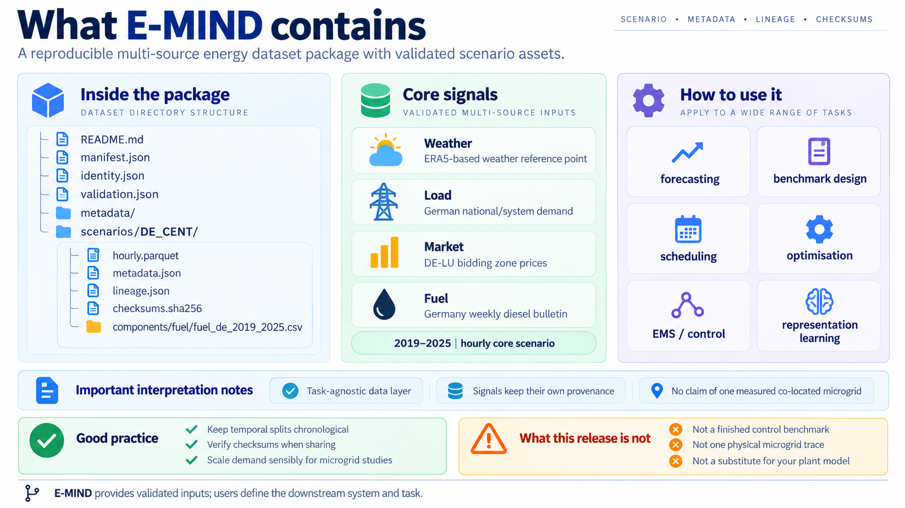

# DE_CENT

**Status:** technically validated, scientifically closed E-MIND scenario (`CORE_FULL_MARKET`). Covers complete years **2019–2025**, with **61,368 hourly UTC intervals** in `[2019-01-01T00:00:00Z, 2026-01-01T00:00:00Z)`. Scientific closure does not imply public archival issuance: the dataset remains pre-release, NOT_ISSUED, not archived, without an E-MIND DOI.

> **DE_CENT is a historically grounded composition of heterogeneous open signals. It is not a measured co-located physical microgrid.**

## DE_CENT scenario overview

This figure describes **DE_CENT only**, including the local package layout; it is not a definitive structure for all future E-MIND scenarios. Its research-use labels describe user-defined experiments, not included controllers, and the local package has not been publicly issued.

| Field | Value |
|---|---|
| Identifier | `DE_CENT` |
| Period | 2019–2025 |
| Canonical timebase | Hourly UTC |
| Weather | ERA5 reference point |
| Load | German national/system load |
| Market | DE-LU day-ahead |
| Fuel | German weekly diesel prices, native side component |

## Core and native side component

`hourly.parquet` combines nine weather columns, German system-load energy and DE-LU day-ahead price, plus `timestamp_utc`. The timestamp is an hourly UTC interval start, not a claim about when a value became available.

- **Weather:** ERA5 reanalysis at 51.00° N, 10.25° E; the surrounding 3×3 stencil is audit-only. Temperature and wind states align at interval start. One-hour surface solar radiation accumulation for `[t,t+1h)` uses provider endpoint `t+1h`; irradiance is accumulation divided by 3600. Wind speed derives from vector components. No PV or wind-turbine electrical power is supplied.
- **Load:** German national/system demand from SMARD. Four native quarter-hour energies sum to `load_energy_mwh`. This conserves energy but loses sub-hourly peaks and ramps. No microgrid scaling is applied in Data.
- **Market:** DE-LU day-ahead wholesale price in EUR/MWh; negative values are valid. Native delivery resolution changes on local 2025-10-01 (2025-09-30T22:00Z). Thereafter the core uses the arithmetic mean of four physical quarter-hour prices per hour. This is not a retail import/export tariff.
- **Fuel:** Germany weekly diesel bulletin from the European Commission. `components/fuel/fuel_de_2019_2025.csv` preserves reference dates and WITH_TAX / WITHOUT_TAX variants, with 356 records per variant from 2019-01-07 through 2025-12-29. Provider values are per 1000 litres; currency linkage remains **UNRESOLVED**, tax default **UNSELECTED**, and precise availability **UNKNOWN**. No interpolation, hourly effective fuel price or generator cost is supplied.

Weather uses point support; load uses national/system support; market uses bidding-zone support; fuel uses country-level bulletin support. Their combination does not establish physical co-location.

## Provenance and limitations

Scenario metadata defines columns, units, cadence and spatial support. Lineage links accepted components to sources and transformations; checksums validate bytes. Availability is **UNKNOWN** for this composition and valid time must not be treated as publication time. Realised weather used ahead of time is a perfect-foresight assumption; a causal controller requires a separately justified information protocol.

The scenario has no canonical plant, demand scale, actions or reward. Read [Dataset overview](../dataset_overview.md) for package access, reading, verification and leakage-free load scaling, and [Research uses](../research_uses.md) for experiment responsibilities.
